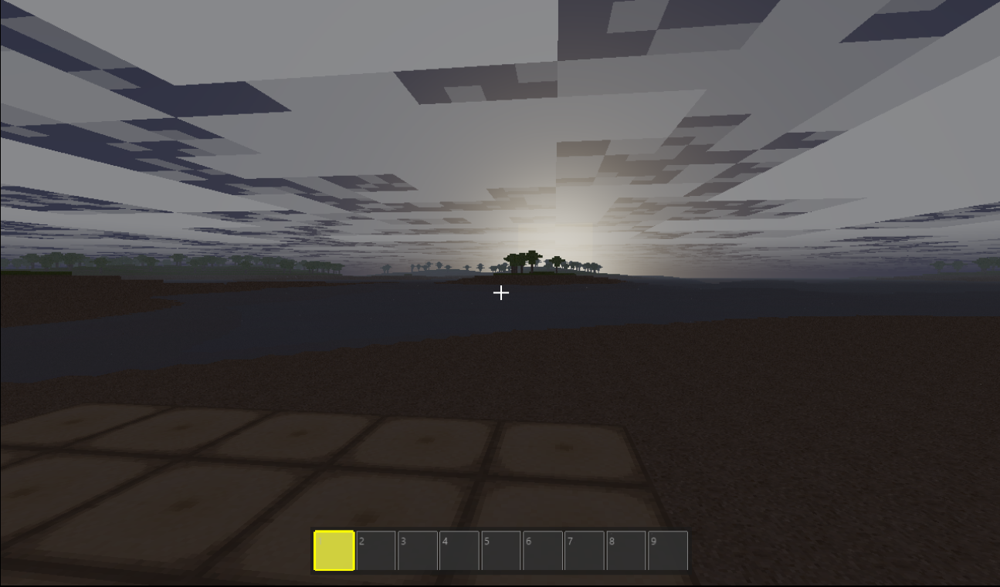

# PerigonForge

PerigonForge is a high-performance voxel-based game engine developed in C# using the OpenTK wrapper for OpenGL. It is designed for scalability and efficiency, leveraging advanced data structures and multi-threaded processing to support large, procedurally generated cubic worlds.

--- 


## Overview

PerigonForge is a voxel game engine that emphasizes optimized memory usage, parallel processing, and modern rendering techniques to maintain smooth performance even in complex environments. It provides a complete foundation for building voxel-based games with well-done terrain, physics, inventory management, and dynamic weather systems.

---

## Features

### Core Systems
- **Octree-Based World Structure**  
  Utilizes 32×32×32 voxel chunks backed by sparse octrees for efficient memory management and spatial organization.

- **Procedural Terrain Generation**  
  Implements multi-octave simplex noise to generate varied landscapes, including beaches, plains, hills, and mountainous regions.

- **Multi-threaded Processing Pipeline**  
  Chunk generation and mesh construction are executed asynchronously across multiple threads to maintain consistent frame rates.

- **First-Person Camera with Physics**  
  Supports walking, swimming, and flying modes with collision detection and player movement mechanics.

### Rendering
- **Dynamic Atmospheric Sky**  
  Includes atmospheric scattering and volumetric cloud rendering for enhanced visual depth.

- **Rendering Optimizations**  
  Incorporates hardware-accelerated view frustum culling and greedy meshing to reduce draw calls and improve performance.

- **Texture Atlas System**  
  Supports efficient texture mapping with per-face block texturing.

- **Custom 3D Model Loading**  
  OBJ model support for complex block models like stairs, slabs, ladders, and furniture.

- **Post-Processing Effects**  
  Advanced rendering effects for enhanced visual quality.

### Interaction and Interface
- **Precision Raycasting**  
  Enables accurate block selection, placement, and removal in real time.

- **Block Rotation System**  
  Blocks support vertical and horizontal rotation for flexible placement.

- **Hotbar System**  
  Features a 9-slot quick-access hotbar with instant selection via numeric input or mouse wheel.

- **Full Inventory System**  
  45-slot inventory (5 rows × 9 columns) with drag and drop functionality, item stacking, and slot management.

- **Performance Monitoring Tools**  
  Provides real-time metrics including FPS, draw calls, and adjustable environmental settings such as fog and render distance.

### Weather and Environment
- **Dynamic Weather System**  
  Realistic weather effects including rain, sun, and dynamic sky colors.

- **Particle Systems**  
  Multiple particle effects for block breaking/placement, rain drops, rain splashes on water, and steam vapor.

---

## Controls

| Key | Action |
|-----|--------|
| W/A/S/D | Move forward/left/back/right |
| Space | Jump / Fly up (when flying) |
| Shift | Fly down / Sprint (when walking) |
| E | Place block |
| Q | Drop item from inventory |
| F9 | Toggle wireframe mode |
| F3 | Toggle debug info |
| 1-9 | Select hotbar slot |
| I | Toggle inventory |
| Mouse Wheel | Cycle hotbar slots |
| Mouse Left | Break block |
| Mouse Right | Place block |
| Escape | Open settings / Close inventory |
| Ctrl | Toggle fly mode |

---

## System Requirements

- .NET 8.0 SDK or later  
- OpenGL 4.3 or higher compatible GPU  
- Windows, Linux, or macOS operating system

---

## Building and Running

```bash
# Restore dependencies
dotnet restore

# Build the project
dotnet build

# Run the game
dotnet run
```

---

## Documentation

For a comprehensive technical reference guide, see [reference.md](./reference.md).

---

## Technology Stack

- **Language**: C# (.NET 8)
- **Graphics**: OpenTK 4.x (OpenGL 4.x)
- **Build System**: dotnet CLI
- **Target Platforms**: Windows, Linux, macOS